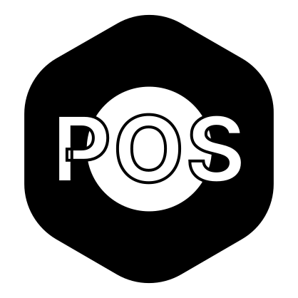
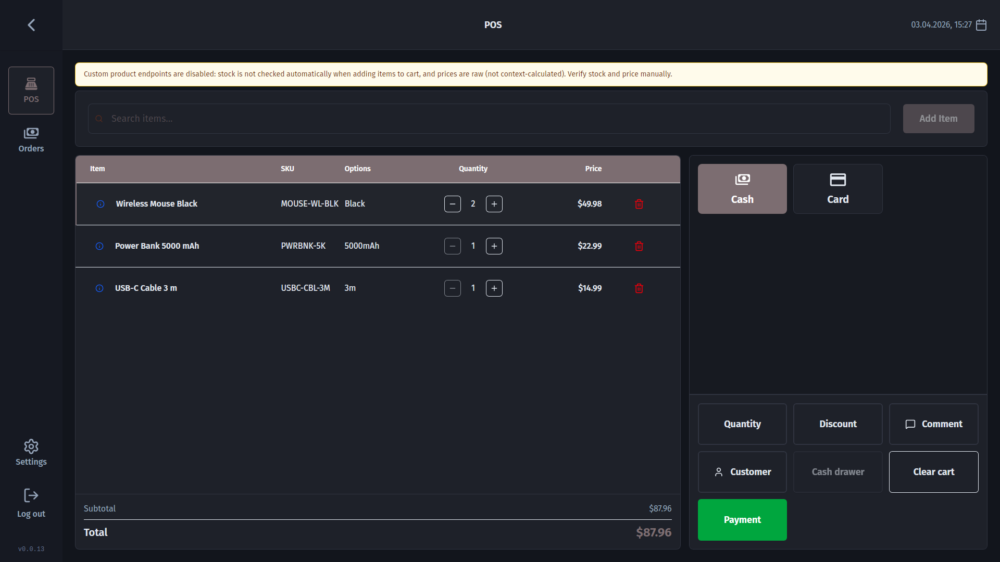

<p align="center">
  
</p>

# Medusa POS

[](https://github.com/narisolutions/medusa-pos/actions/workflows/release.yml)
[](https://github.com/narisolutions/medusa-pos/releases/latest)
[](LICENSE)

Cross-platform POS app for Medusa built with React + Tauri 2.

> This project is under active development. APIs, behavior, and UX may change.

Medusa POS is an independent open-source project and is not officially affiliated with Medusa.

<p align="center">
  
</p>

## Compatibility

| Capability | Vanilla Medusa (`admin.product.list`) | Medusa + POS plugin/custom `/pos` endpoints |
|---|---|---|
| Add product to cart | ✅ | ✅ |
| Reliable inventory check before adding | ❌ (variant `inventory_quantity` may be missing) | ✅ |
| Context-aware computed variant price | ❌ (raw prices array) | ✅ |
| Inventory kit availability checks | ❌ | ✅ |

## Medusa Version Tested

- Frontend SDK/types in this project: `@medusajs/js-sdk@2.15.3`, `@medusajs/types@2.15.3`
- App behavior validated against Medusa Admin API v2.15.x style responses.

If your backend is older/newer, behavior can differ (especially pricing and inventory fields).

## Quick Start

### Prerequisites

- Node.js 20.19+, 22.13+, or 24+ (see `engines` in `package.json`)
- Rust (stable)
- Yarn
- Tauri prerequisites for your OS: [tauri.app/start/prerequisites](https://tauri.app/start/prerequisites/)

### Install

```bash
yarn install
```

### Run

```bash
# Browser (UI-only)
yarn dev

# Desktop (recommended)
yarn tauri dev
```

Important: full app flow requires Tauri runtime. This project stores backend configuration in
Tauri storage/config files on first setup, so `yarn dev` is only for limited UI work. Use
`yarn tauri dev` for real usage and testing.

### Build / Lint

```bash
yarn build
yarn lint
yarn typecheck
```

## Core Features

- Checkout UI with barcode scanning, cart, payment dialog
- Draft order creation and updates through Medusa Admin APIs
- Receipt printing (network / USB / Bluetooth), cash drawer trigger
- Order list and order detail views
- Settings for API/store, printers, branding, preferences
- Multi-store backend configuration

## Environment

Use `.env`, `.env.staging`, or `.env.production`:

```env
VITE_BACKEND_URL=https://your-medusa-instance.example.com/
```

The backend URL can also be configured at runtime via Store Setup.

## Medusa API Support Notes

| Topic | Support in Medusa (current observed behavior) |
|---|---|
| Draft order discount totals from Sale Price Lists (`original_amount - calculated_amount`) | ❌ Not automatically reflected in draft-order discount totals unless Promotions are applied separately |
| Creating admin payment collections with `payments[]`, `provider_id`, `provider_data` in one call | ❌ Not supported by current `AdminCreatePaymentCollection` typing/API shape |

These are tracked as known limitations for now and can affect POS discount/payment reporting workflows.

## Downloads

Prebuilt binaries are available on the [Releases](https://github.com/narisolutions/medusa-pos/releases/latest) page for each tagged version.

| Platform | Architecture | Format |
|---|---|---|
| Windows | x86_64 | `.msi` installer |
| macOS | Apple Silicon (aarch64) | `.dmg` disk image |
| macOS | Intel (x86_64) | `.dmg` disk image |
| Linux | x86_64 | `.AppImage` |

All builds include signed updater artifacts so the app can auto-update itself after installation.

### Code signing notice

**Windows** — The MSI installer is **not code-signed** with a trusted certificate. Windows SmartScreen will show an "Unknown Publisher" warning on first install. You can bypass it by clicking *More info* → *Run anyway*.

**macOS** — The DMG is ad-hoc signed but **not notarized** with an Apple Developer ID. macOS Gatekeeper will block it by default. To open it, right-click the app → *Open*, or run `xattr -cr /Applications/Medusa\ POS.app` after dragging it to Applications.

**Linux** — No code signing is required. The AppImage runs directly after making it executable (`chmod +x`).

## Roadmap

We're actively building out Medusa POS into a full-featured retail system. Here's what's coming:

- **Medusa POS plugin** *(released)* — The custom backend endpoints that power inventory checks, context-aware pricing, and kit support are available as a standalone Medusa plugin: [`@narisolutions/medusa-plugin-pos`](https://github.com/narisolutions/medusa-plugins).
- **Cash reconciliation** *(coming soon)* — Guide staff through end-of-shift cash counting, compare against system totals, and record any discrepancies.
- **Payment provider integrations** — Native support for physical card readers and payment terminals, with real provider IDs recorded against each order for accurate reporting.
- **Manual card transactions** — Accept card payments through any external terminal and record the method used against the order, no payment provider integration required.
- **Draft orders & parked sales** — A dedicated Draft Orders tab lets staff park an in-progress sale and pick it up later, with inventory held during the session.
- **Refunds, exchanges & partial refunds** — Handle the full post-sale lifecycle from the order page: full or partial refunds, product exchanges, and additional charges, all with a complete audit trail.
- **Quotations** — Create and send formal quotations to customers directly from the POS, useful for large or made-to-order purchases.
- **Z-report** — Generate a daily sales summary at end of shift, printable to a receipt printer or exportable as PDF.
- **Manager PIN override** — A PIN-based approval flow that lets managers authorize sensitive actions (discounts, voids, refunds) without handing over their session.

## Useful Links

- [Medusa POS Plugin](https://github.com/narisolutions/medusa-plugins) — `@narisolutions/medusa-plugin-pos` on npm
- [Contributing](CONTRIBUTING.md)
- [Discussions](https://github.com/narisolutions/medusa-pos/discussions)
- [Issues](https://github.com/narisolutions/medusa-pos/issues)
- [Security](SECURITY.md)
- [License](LICENSE)
